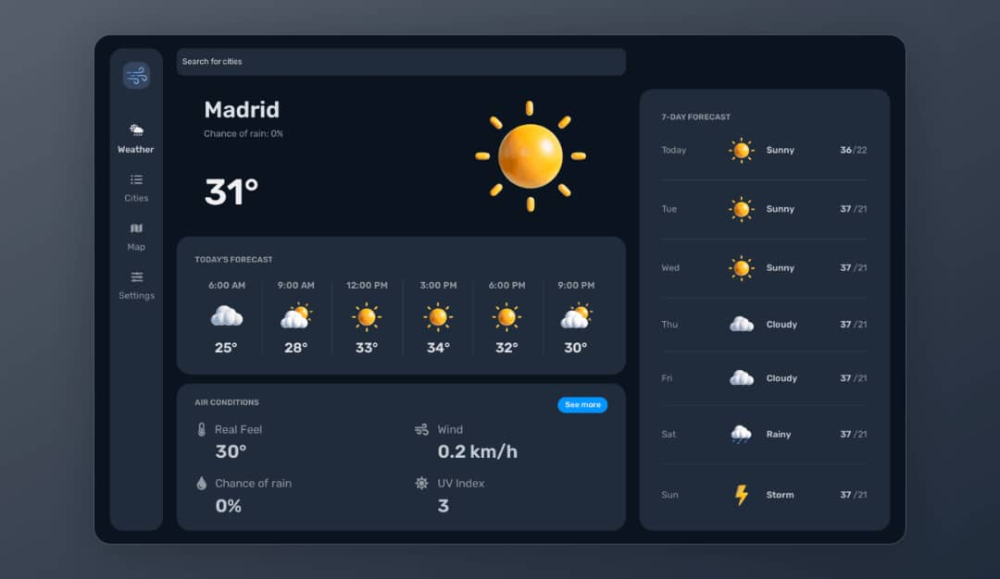

# Weather App



A simple weather application built using React and Tailwind CSS. This project is part of my portfolio showcasing my frontend development skills.

## Features

- **Current Weather:** Display current weather conditions for a specified location.
- **Weather Forecast:** Show a 5-day weather forecast with details like temperature, humidity, and wind speed.
- **Search Functionality:** Search for weather information by city name.
- **Responsive Design:** Fully responsive layout using Tailwind CSS for a seamless experience across devices.

## Technologies Used

- React
- Tailwind CSS
- OpenWeatherMap API

## Installation

1. Clone the repository:
   ```bash
   git clone https://github.com/your-username/weather-app.git
   ```
2. Navigate into the project directory:
   ```bash
   cd weather-app
   ```
3. Install dependencies:
   ```bash
   npm install
   ```
   
## Configuration

1. Sign up for an API key at [OpenWeatherMap](https://openweathermap.org/api) if you haven't already.
2. Create a `.env` file in the root directory of the project.
3. Add your API key to the `.env` file:
   ```plaintext
   REACT_APP_API_KEY=your_api_key_here
   ```

## Usage

1. Start the development server:
   ```bash
   npm run dev
   ```
2. Open [http://localhost:3000](http://localhost:3000) to view it in the browser.

## Deployment

This project can be easily deployed to platforms like Netlify or Vercel for showcasing in your portfolio.

## License

This project is licensed under the MIT License - see the [LICENSE](LICENSE) file for details.

## Acknowledgments

- Weather data provided by [OpenWeatherMap](https://openweathermap.org/)
- Icons from [Heroicons](https://heroicons.com/)

## Screenshots


<!--  -->
